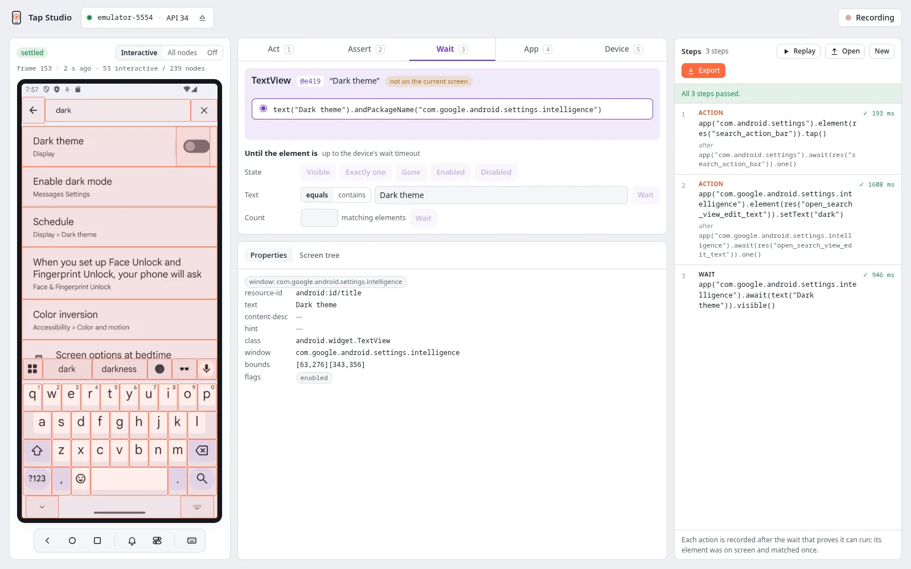

<div class="tap-hero" markdown>

<div class="tap-hero__text" markdown>


# End-to-end tests for Android, in Kotlin or Python

Write UI tests with the tools you already use, JUnit 5 or pytest, and run them on real phones
and emulators. Your app stays as it is: Tap drives it from the outside.

[Get started](guide/getting-started.md){ .md-button .md-button--primary }
[Download](download.md){ .md-button }

<p class="tap-hero__meta">Open source, Apache 2.0 · Android 8.0+ (API 26) · Linux, macOS, Windows</p>

</div>

<figure class="tap-hero__shot" markdown>
{ width="1600" height="1000" }
<figcaption>Tap Studio, recording a search in the Settings app.</figcaption>
</figure>

</div>

## Three ways to drive a device

=== "Write a test"

    The same test in either language. Each action finds its element afresh, needs exactly one
    match, and waits only where you say.

    === "Kotlin (JUnit 5)"

        ```kotlin
        import io.github.noamcohen48.tap.junit5.*
        import io.github.noamcohen48.tap.sdk.*
        import org.junit.jupiter.api.Test

        @TapTest
        class CheckoutTest {
            @Test
            fun buysAnItem(device: Device) = tapTest {
                val shop = device.app("com.example.shop")
                shop.coldLaunch()
                shop.element(res("buy_button")).tap()
                shop.await(text("Order placed")).visible()
            }
        }
        ```

    === "Python (pytest)"

        ```python
        from tap_e2e import res, text

        def test_buys_an_item(tap_device):
            shop = tap_device.app("com.example.shop")
            shop.cold_launch()
            shop.element(res("buy_button")).tap()
            shop.wait(text("Order placed")).visible()
        ```

    [Write your first test](guide/getting-started.md){ .md-button }

=== "Let an agent drive"

    `tap-agent` gives Claude Code, Cursor or any MCP client the same device: it reads the screen
    as text, acts on it, and checks the result. A real session on an emulator:

    ```console
    $ tap-agent attach emulator-5554
    attached emulator-5554 to session 'agent', idle timeout 15m
    $ tap-agent app cold-launch com.android.settings
    cold-launched com.android.settings (pid 14853)
    $ tap-agent snapshot -i
    # com.android.settings
    @e8  [ImageView]  desc="Profile picture, double tap to open Google Account"  id=account_avatar
    @e12  [ViewGroup]  id=search_action_bar
    …
    $ tap-agent tap @e12
    tapped @e12
    $ tap-agent fill id=open_search_view_edit_text dark --settle
    filled id=open_search_view_edit_text
    # com.google.android.settings.intelligence
    + @e272  [TextView]  "Dark theme"  id=android:id/title
    + @e279  [TextView]  "Enable dark mode"  id=android:id/title
    …
    $ tap-agent tap "text~=dark"
    error: AMBIGUOUS during tap node { match { property: PROPERTY_TEXT value: "dark" mode: MATCH_CONTAINS } } …
    several nodes match; use a ref from `snapshot` or a narrower selector
    ```

    [tap-agent](agent/index.md){ .md-button } [Commands](agent/commands.md){ .md-button }

=== "Record in the browser"

    Tap Studio shows the device's screen with its elements outlined. Pick an element, choose
    what to do with it, and each step is recorded with the selector a test would use, never a
    screen coordinate. Replay the steps, then turn them into a test.

    { width="1600" height="1000" }

    [Tap Studio](studio/index.md){ .md-button }

## How it works

<div class="tap-flow" role="list" aria-label="How a Tap command reaches the device">
  <div class="tap-flow__box" role="listitem">
    <strong>Your tests and tools</strong>
    <span>JUnit 5, pytest, tap-agent, Tap Studio</span>
  </div>
  <div class="tap-flow__arrow" aria-hidden="true">gRPC</div>
  <div class="tap-flow__box tap-flow__box--accent" role="listitem">
    <strong>The <code>tap</code> server</strong>
    <span>one per machine; owns ADB and the devices</span>
  </div>
  <div class="tap-flow__arrow" aria-hidden="true">ADB</div>
  <div class="tap-flow__box" role="listitem">
    <strong>Tap's driver, on each device</strong>
    <span>its own app, built on UiAutomator</span>
  </div>
  <div class="tap-flow__arrow" aria-hidden="true">UI</div>
  <div class="tap-flow__box" role="listitem">
    <strong>Your app</strong>
    <span>unchanged; any app on the device</span>
  </div>
</div>

You start the server once (`tap start`). Every client talks to it, so tests in Kotlin and Python,
an agent and Studio share the same devices without stepping on each other: a device is held by
one of them at a time. The driver is a separate app, so it survives your app being force-stopped
or cleared. [Architecture](development/architecture.md) has the details.

## Why Tap

<div class="grid cards" markdown>

-   :material-target:{ .lg .middle } **One match, or no action**

    ---

    Every action finds its element afresh and needs exactly one match. Zero or several fail
    with `NOT_FOUND` or `AMBIGUOUS` before anything touches the device.

    [:octicons-arrow-right-24: Selectors](guide/selectors.md)

-   :material-timer-sand:{ .lg .middle } **Waits you can see**

    ---

    No hidden retries or implicit waits. A test waits where it says so, for a condition it
    names, so it stays fast and predictable.

    [:octicons-arrow-right-24: Waits](guide/waits.md)

-   :material-file-alert-outline:{ .lg .middle } **Failures with evidence**

    ---

    Every failure has a specific code, plus a screenshot, the screen layout and the driver log
    of each device in the test.

    [:octicons-arrow-right-24: Errors](guide/errors.md) · [Artifacts](guide/artifacts.md)

-   :material-cellphone-link:{ .lg .middle } **Several devices in one test**

    ---

    Chat, calls, sharing: give each device a role and drive them together from one test.

    [:octicons-arrow-right-24: Multi-device tests](guide/multi-device.md)

-   :material-robot-outline:{ .lg .middle } **Built for coding agents**

    ---

    A CLI and an MCP server that read the screen as text with refs, report what each step
    changed, and export the session for a test.

    [:octicons-arrow-right-24: tap-agent](agent/index.md)

-   :material-language-markdown-outline:{ .lg .middle } **Docs your agent can read**

    ---

    Every page is also published as Markdown (`guide/selectors/` is `guide/selectors.md`), and
    `llms-full.txt` holds the whole guide in one file for an agent to read.

    [:octicons-arrow-right-24: llms.txt](https://noamcohen48.github.io/tap/llms.txt)

</div>

!!! tip "Coming from another tool?"

    [Coming from Maestro or Appium](guide/coming-from.md) maps each tool's everyday commands to
    Tap and calls out where Tap deliberately behaves differently.

## Open source

Tap is open source under the Apache License 2.0. Issues and pull requests are welcome on
[GitHub](https://github.com/NoamCohen48/tap); see the
[contributing guide](https://github.com/NoamCohen48/tap/blob/main/CONTRIBUTING.md).
