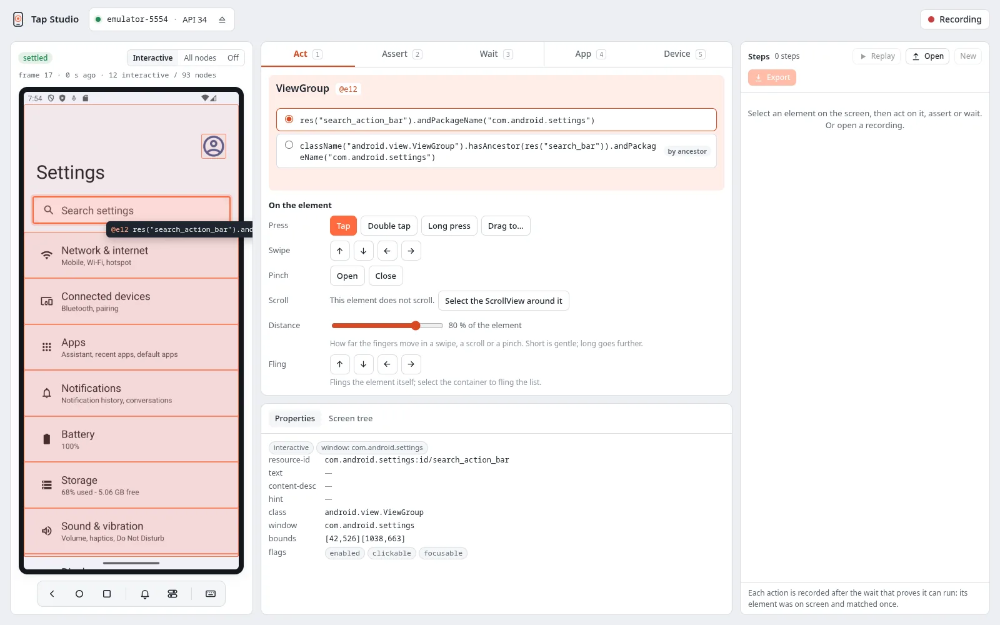
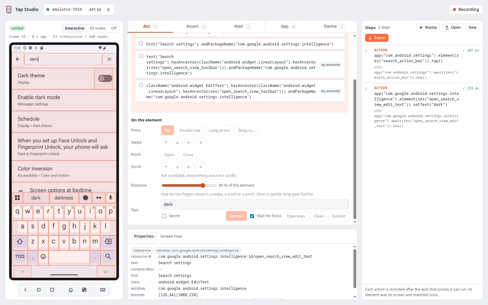
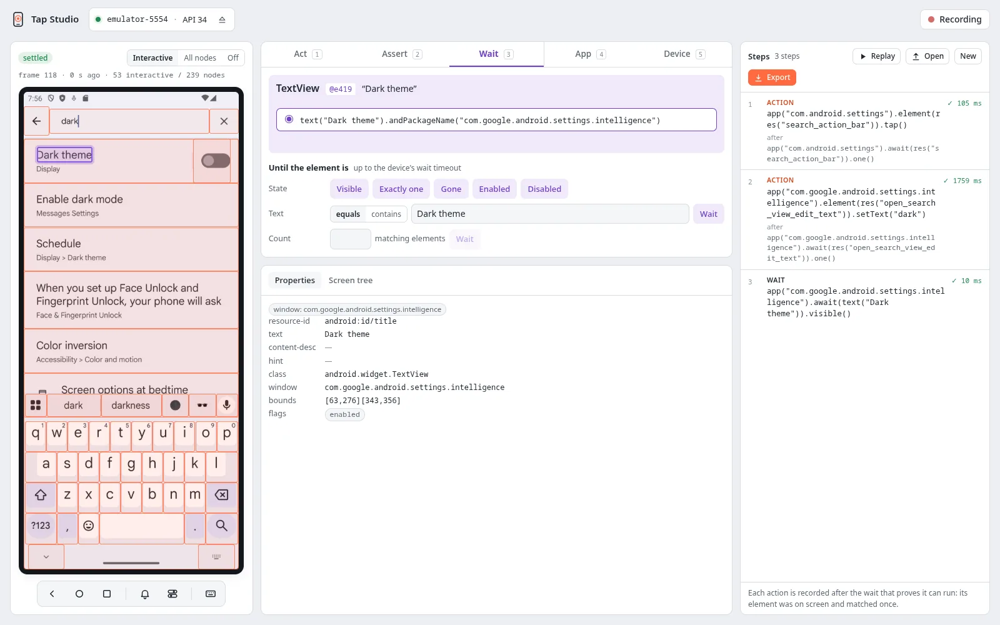
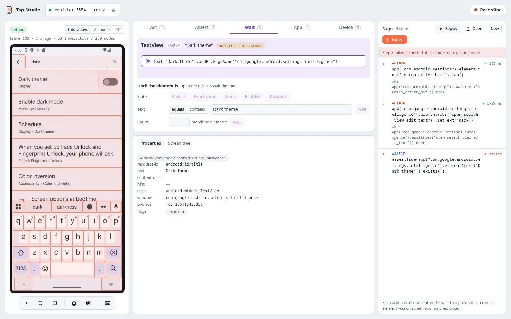

# A first recording

This walkthrough records a search in the emulator's Settings app: open search, type "dark",
and check that the Dark theme setting is found. Start `tap-studio`, attach the device and open
Settings on it.

## 1. Select an element

Click the search bar on the screen. Nothing runs on the device yet: the composer shows the
element's class, its ref (`@e12`) and its selector candidates. The first one is what gets
recorded, here `res("search_action_bar").andPackageName("com.android.settings")`. The
inspector below lists the element's properties.

{ width="1600" height="1000" }

## 2. Act on it

Press **Tap** (or `1` for the Act tab). The tap runs on the device and becomes step 1. The step
shows what it does in the Kotlin client's words, the wait it runs after (`await(…).one()`: the
element was on screen and matched once) and how long it took.

Settings opens its search page. Select the search field, type `dark` into **Text** and press
**Set text**: step 2. Studio follows the screen to the new app
(`com.google.android.settings.intelligence`) on its own.

{ width="1600" height="1000" }

## 3. Check the result with a wait

Switch the overlay to **All nodes** and select the "Dark theme" title: its selector is
`text("Dark theme")`. On the **Wait** tab, press **Visible** to record step 3.

{ width="1600" height="1000" }

!!! tip "Assert or Wait?"

    An **Assert** checks the element as it is at that moment and fails at once. Right after you
    type, the results are still on their way, so on a replay an assertion here can run before
    they appear:

    { width="1600" height="1000" }

    Use **Wait** for something that is about to happen, and **Assert** for something that
    already holds (a field's text after you set it, a button's enabled state).

## 4. Replay, edit and export

Go back to the Settings home screen and press **Replay**: every step runs from the first, and
the panel reports *All 3 steps passed* (the screenshot on [Tap Studio](index.md)). Click a step to
change its selector, value or note, run it alone, move it or delete it
([Editing steps](steps.md#editing-steps)). **Export** gives the recording as JSON
([Export and open](steps.md#export-and-open)), and the steps map one to one onto a test (in Kotlin, the same calls in camelCase:
[Kotlin + JUnit 5](../sdk/kotlin.md)):

```python
from tap_e2e import res, text

def test_finds_dark_theme(tap_device):
    settings = tap_device.app("com.android.settings")
    search = tap_device.app("com.google.android.settings.intelligence")
    settings.cold_launch()
    settings.wait(res("search_action_bar")).one().tap()
    search.wait(res("open_search_view_edit_text")).one().set_text("dark")
    search.wait(text("Dark theme")).visible()
```

The test starts with a cold launch so it begins from a known screen; in Studio, record it first
from the **App** tab. [Turning a recording into a test](steps.md#turning-a-recording-into-a-test) has
the full mapping.
