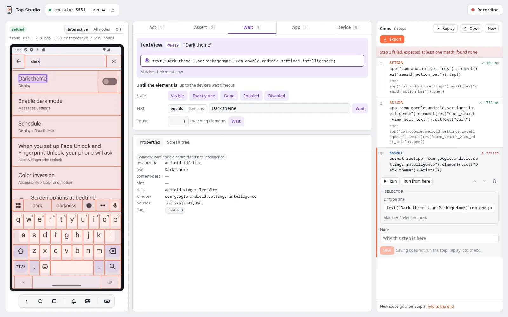
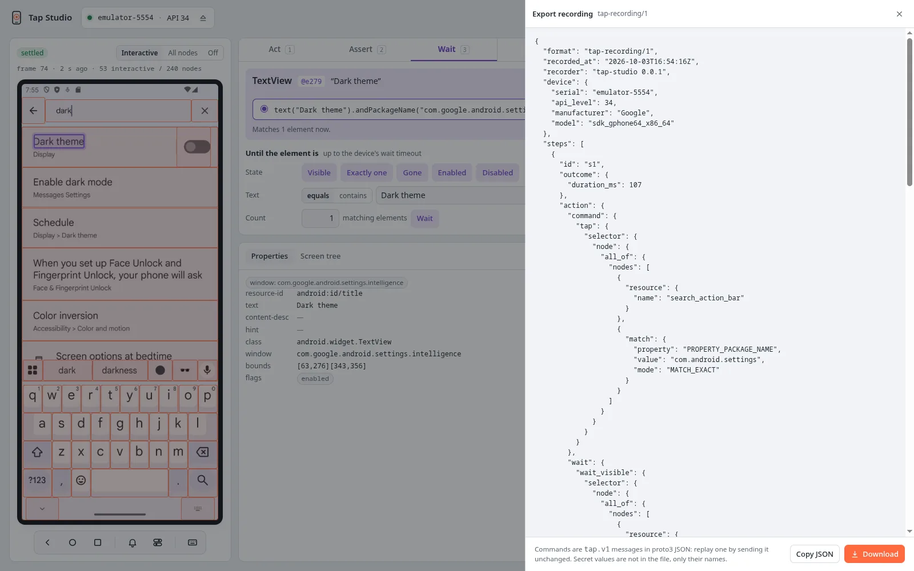

# Steps and export

## Editing steps

Click a step to open it:

{ width="1600" height="1000" }

- **Selector:** choose another candidate, or type a selector in the Kotlin DSL
  (`res("search").hasAncestor(res("toolbar"))`, `text("Add").at(1)`). A recorded selector
  usually ends in `.andPackageName("com.example.basket")`: the package of the element's app,
  which a test writes as `app("com.example.basket").element(…)`. Remove it to match on the
  whole screen. The line below shows how many elements the selector matches on the current
  screen.
- **Value and secret:** change the text of a set text or type step, or make it secret, and
  the expected text of a text wait or assertion.
- **Scroll until:** change the selector of the element a scroll until brings into view, its
  direction, its distance and its maximum number of scrolls.
- **Gesture:** change a swipe's or a scroll's direction and distance.
- **Note:** a free-text note, kept in the file.
- **Run** runs the step alone. **Run from here** runs it and every step after it. Move up, move
  down and delete are there too.

New steps go after the selected step, or at the end when none is selected.

## Replay

**Replay** runs every step from the first and stops at the first failure. The failed step shows
the driver's error. If the recording does not start with an app step, the page offers to cold
launch the app first, because a replay from an unknown screen is not reproducible. Steps with
secrets ask for the values before the run. The values are kept only while the studio runs.

## Export and open

**Export** shows the recording as `tap-recording/1` JSON, with **Copy JSON** and **Download**.
**Open** loads such a file to continue or replay it. **New** starts an empty recording. Both ask
before discarding recorded steps.

{ width="1600" height="1000" }

```json
{
  "format": "tap-recording/1",
  "recorded_at": "2026-09-30T09:12:44Z",
  "recorder": "tap-studio 0.0.1",
  "device": {"serial": "emulator-5554", "api_level": 34, "manufacturer": "Google", "model": "sdk_gphone64_x86_64"},
  "steps": [
    {"id": "s1", "app": {"operation": "cold_launch", "package_name": "com.example.basket"}},
    {"id": "s2", "action": {
      "command": {"set_text": {"selector": {"node": {"all_of": {"nodes": [{"resource": {"name": "search"}},
        {"match": {"property": "PROPERTY_PACKAGE_NAME", "value": "com.example.basket", "mode": "MATCH_EXACT"}}]}}}, "text": "wool"}},
      "wait": {"wait_visible": {"selector": {"node": {"all_of": {"nodes": [{"resource": {"name": "search"}},
        {"match": {"property": "PROPERTY_PACKAGE_NAME", "value": "com.example.basket", "mode": "MATCH_EXACT"}}]}}}, "exactly_one": true}},
      "selector_origin": "SELECTOR_ORIGIN_SYNTHESIZED"}},
    {"id": "s3", "wait": {"selector": {"node": {"match": {"property": "PROPERTY_TEXT", "value": "3 results"}}},
      "condition": "CONDITION_VISIBLE"}},
    {"id": "s4", "assertion": {"selector": {"node": {"resource": {"name": "checkout"}}},
      "check": "CHECK_ENABLED"}}
  ]
}
```

Steps carry `tap.v1` messages in proto3 JSON, the same encoding as the
[gRPC API](../reference/grpc.md). Any language can read them, and a step replays by sending
its messages unchanged: an action's `wait`, then its `command`. The file records the device it
was made on, but it replays on any device. It never contains a secret's value, only its name
(`"secret": "password"`, listed in `secrets` at the top).

## Turning a recording into a test

The studio does not generate code. A recording maps one to one onto the client APIs, so you,
or a coding agent ([tap-agent](../agent/index.md)), write the test from it:

| Step | Kotlin | Python |
|---|---|---|
| `app` `cold_launch` | `app.coldLaunch()` | `app.cold_launch()` |
| `action` `set_text` on `res("search")` in `com.example.basket` | `app.await(res("search")).one().setText("wool")` | `app.wait(res("search")).one().set_text("wool")` |
| `wait` `CONDITION_VISIBLE`, no package | `device.screen.await(text("3 results")).visible()` | `device.screen.wait(text("3 results")).visible()` |
| `assertion` `CHECK_ENABLED` | `assertTrue(device.screen.element(res("checkout")).isEnabled())` | `assert device.screen.element(res("checkout")).is_enabled()` |
| `assertion` `CHECK_TEXT_EQUALS` `"Wool"` | `assertEquals("Wool", ….text())` | `assert ….text() == "Wool"` |
| `scroll_until` on `res("list")`, target `text("Row 40")` | `….element(res("list")).scrollUntil(text("Row 40"))` | `….element(res("list")).scroll_until(text("Row 40"))` |
| `app_wait` `wait_app_visible` / `wait_screen_stable` | `app.awaitVisible()` / `app.awaitScreenStable()` | `app.await_visible()` / `app.await_screen_stable()` |
| `action` `set_orientation` (no selector) | `device.setOrientation(Orientation.LANDSCAPE)` | `device.set_orientation(Orientation.LANDSCAPE)` |
| `device_wait` `await_toast` | `device.awaitToast("Saved")` | `device.await_toast("Saved")` |
| `device` `set_animations` | `device.setAnimations(false)` | `device.set_animations(False)` |
| `device_assertion` `DEVICE_CHECK_KEYBOARD_SHOWN` | `assertTrue(device.keyboardShown())` | `assert device.keyboard_shown()` |

A selector whose top-level conjunction has a `PROPERTY_PACKAGE_NAME` match is that app's:
`app = device.app("com.example.basket")`, and the rest of the selector goes to
`app.element` / `app.await`. A selector without one is `device.screen`'s. The step list shows
each step that way.

Keep the selectors the studio chose: they matched exactly one element when the step was
recorded, and replay proved them.
